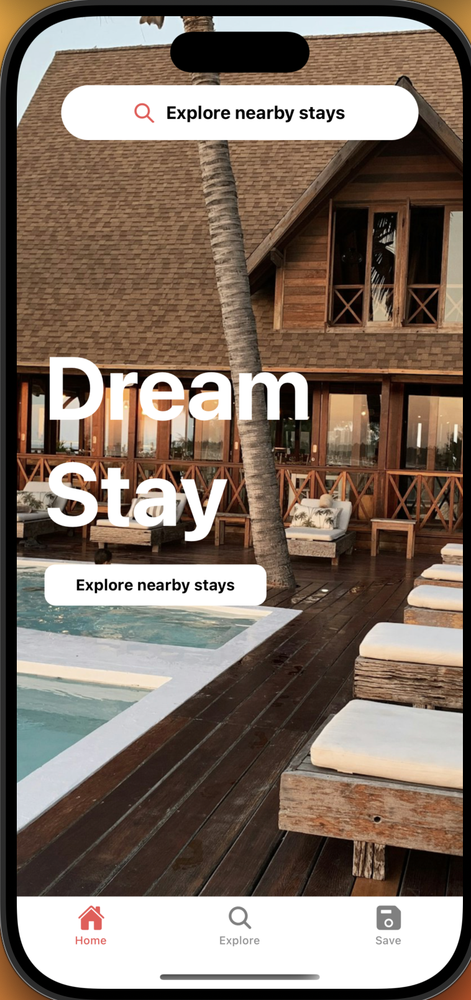
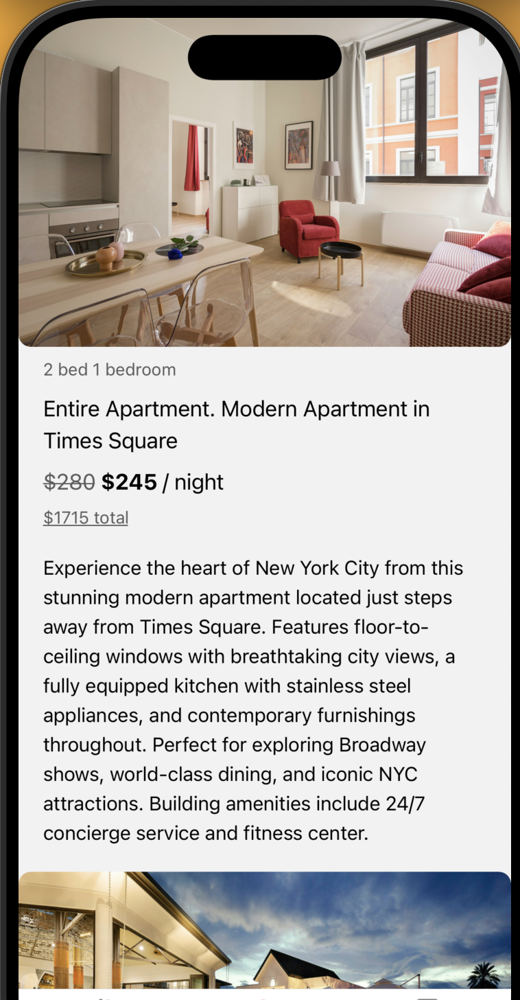

# DreamStay 🏡

A beautiful and simple accommodation booking app built with React Native and Expo.

## Features ✨

- 🏠 Browse stunning accommodations from around the world
- 🔍 Search and explore different properties
- 📱 Clean and modern mobile interface
- 🌍 Real locations with detailed descriptions

## Tech Stack 🛠️

- **React Native** - Mobile framework
- **Expo** - Development platform
- **TypeScript** - Type safety
- **Expo Router** - Navigation

## Getting Started 🚀

1. **Install dependencies**
   ```bash
   yarn install
   ```

2. **Start the development server**
   ```bash
   npx expo start
   ```

3. **Run on your device**
   - Scan the QR code with Expo Go app
   - Or run on iOS/Android simulator

## Project Structure 📁

```
app/
├── (tabs)/           # Tab navigation screens
│   ├── index.tsx     # Home screen
│   └── explore.tsx   # explore screen
├── _layout.tsx       # Root layout
components/
├── Place.tsx         # Property component
constants/
├── places.ts         # Sample data
```

## Screenshots 📱

The app features a beautiful home screen with luxury accommodations and an intuitive search interface.



---

Made with ❤️ using Expo and React Native
